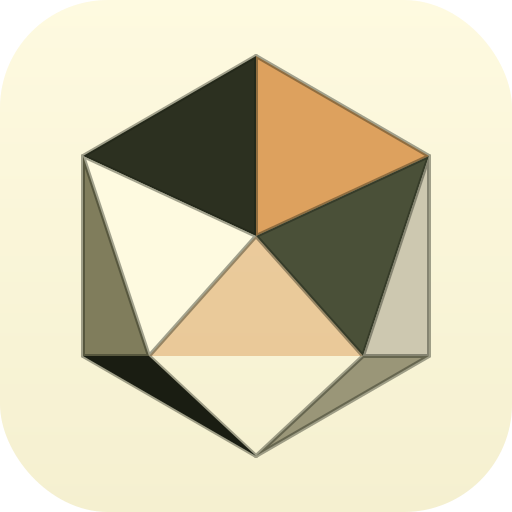

# Passive Perception

A macOS app that listens to your D&D sessions, transcribes the conversation with speaker identification, and writes campaign notes that are biased toward *your* character — what *you* experienced, what *your* goals are, what clues relate to *your* backstory.



## What It Does

1. **Captures audio** from Discord via the BlackHole virtual audio driver.
2. **Transcribes + diarizes** the full session through **Deepgram Nova-3**, with your campaign roster fed in as `keyterm` bias so fantasy proper nouns come out correct.
3. **Identifies speakers** with a post-session Gemini pass that writes a one-line summary per speaker — you label them once in the UI (pre-filled with the best guess from your party roster) and the rest of the pipeline takes over.
4. **Classifies every utterance** as either in-character play or table-talk (rules lookups, off-topic chatter). Table-talk is dimmed in the transcript and *excluded* from the notes pass so your summary isn't polluted by the pizza order debate.
5. **Writes structured notes** with **Google Gemini 2.5 Flash** — session summary, NPCs, locations, plot points, open questions — all phrased in the second person, weighted toward what *your* character would care about.
6. **Merges back into a persistent campaign file**. New NPCs and locations append to your roster, plot points become ongoing threads, open questions become unresolved hooks. Every session builds on the last.
7. **Auto-exports** the finished notes to your Obsidian vault if configured.

## The load-bearing idea: a persistent campaign roster

A campaign file holds your character (race/class/subclass/backstory/goals), your party, the NPCs and locations you've encountered, and a free-form "what I care about" perspective field. Before each session you add a pre-session brief ("tonight we confront Xanathar — I want to find out what he knows about my brother").

All of this — the roster, the brief, your character's perspective — is injected into Gemini's system prompt every time it processes the transcript. That's what makes the notes intelligent across sessions instead of treating every recording as a blank slate.

## Requirements

- **macOS** (Apple Silicon recommended) — shipped as a signed DMG
- **Windows 10/11** — alpha, run-from-source only (see the _Windows (alpha)_ section below)
- **Python 3.11** (the setup script installs this via pyenv on macOS)
- **Homebrew** on macOS ([install here](https://brew.sh))
- A **[Deepgram](https://console.deepgram.com/)** API key — $200 of free credit, no card required
- A **[Google Gemini](https://aistudio.google.com/apikey)** API key — generous free tier works

No cloud subscription on our side — you bring your own API keys so you control the billing. Every call is sent with `mip_opt_out=true` to Deepgram and Gemini's paid-tier no-training guarantee kicks in once you enable billing.

## Install

1. Download the latest DMG from [Releases](https://github.com/letuswrapped/PassivePerception/releases/latest)
2. Drag **Passive Perception** to Applications and launch it
3. Walk through onboarding: enter both API keys → set up BlackHole / Multi-Output Device → create your first campaign (name + character) → done
4. You're on the home screen. Write a pre-session brief, hit **Record**, play your game

## Quick Start (from source)

```bash
git clone https://github.com/letuswrapped/PassivePerception.git
cd PassivePerception
./setup.sh                          # Python 3.11 + venv + deps + BlackHole
source .venv/bin/activate
python run.py                       # opens the native window
```

Keys can be entered through Settings → API Keys in the app, or placed manually in `~/Library/Application Support/Passive Perception/.env`:

```
DEEPGRAM_API_KEY=...
GEMINI_API_KEY=...
```

## Audio Setup

To capture Discord audio, create a **Multi-Output Device** so you can hear the call *and* have the app see it:

1. Open **Audio MIDI Setup** (Applications > Utilities)
2. Click **+** at the bottom-left → **Create Multi-Output Device**
3. Check both your **headphones/speakers** and **BlackHole 2ch**
4. Right-click the new device → **Use This Device For Sound Output**
5. In Discord: Settings → Voice & Video → Output Device → **Multi-Output Device**

The onboarding flow has a button that opens Audio MIDI Setup for you.

## How a session runs

1. **Home** — pick your campaign, fill in tonight's pre-session brief, hit **Record**.
2. **Live** — the app captures silently. No live transcript (you're playing, not reading). Your roster is shown in the sidebar so you can see exactly what context is feeding the AI. Notes panel refreshes every ~15 minutes with a rough preview.
3. **Stop** — Deepgram transcribes the full session with diarization + keyterm bias. Gemini runs **Pass 1** to summarize each speaker and classify every utterance. Takes ~20 seconds.
4. **Label speakers** — one card per speaker with a one-line summary, sample quotes, and a pre-filled guess from your roster. You type names (or hit **Skip** to use "Speaker 1/2/3") and click **Finalize**.
5. **Notes** — Gemini's **Pass 2** runs over the *labeled + in-character-only* transcript. You get summary, NPCs, locations, plot points, open questions.
6. **Campaign merge** — new entities append to your roster, the summary becomes the "last time on…" recap for next session. Obsidian export fires if configured.

If you quit mid-labeling, the next launch offers a **Resume labeling** banner — Pass 1 artifacts are persisted to disk, nothing is lost.

## Configuration

`config.yaml` for non-secret runtime behaviour:

```yaml
audio:
  device: "BlackHole 2ch"
  chunk_duration: 30          # seconds per on-disk WAV chunk
notes:
  update_interval: 900        # seconds between mid-session notes refreshes (default 15 min)
output:
  directory: "./sessions"
  auto_delete_audio: true
```

API keys live in `~/Library/Application Support/Passive Perception/.env` (never in the repo, never in `config.yaml`).

## Architecture

```
Record:   BlackHole + mic → AudioCapture → 30s WAV chunks → disk
Every 15 min:   new chunks → Deepgram (preview) → Gemini preview pass → notes panel
Stop (Pass 1):  all chunks → Deepgram (diarize + keyterm) → canonical transcript
                → Gemini Pass 1 → per-speaker summaries + in_character/other tags
                → pass1.json + transcript.md written to disk
Label speakers
Finalize (Pass 2):  labeled + in_character-only transcript → Gemini → SessionNotes
                    → notes.md + Obsidian export + campaign roster merge
```

Session state is a proper state machine: `RUNNING → PROCESSING_PASS1 → AWAITING_LABELS → PROCESSING_PASS2 → IDLE`. Pass 1 artifacts on disk mean an app crash between labeling and finalize doesn't lose work — the next launch offers to resume.

## Project Structure

```
PassivePerception/
├── run.py                    # Entry point, native window (pywebview)
├── config.yaml               # Non-secret runtime config
├── setup.sh                  # One-command dev setup
├── build_macos.sh            # Signed + notarized .app + DMG
├── src/
│   ├── app.py                # FastAPI routes — REST only, no WebSockets
│   ├── cloud_config.py       # API key storage in Application Support/.env
│   ├── audio/                # Capture, buffering, device enumeration
│   ├── campaign/             # Persistent campaign roster (Pydantic + JSON per file)
│   ├── transcription/        # Deepgram Nova-3 wrapper + WAV concat
│   ├── notes/                # Gemini pass 1 + pass 2, Pydantic schemas, prompts
│   ├── session/              # Lifecycle state machine, storage, Obsidian export
│   └── ui/static/            # Frontend — vanilla HTML/CSS/JS, no build step
└── sessions/                 # Saved session data (gitignored)
```

## Tech Stack

- **Transcription + diarization:** [Deepgram Nova-3](https://deepgram.com) via `deepgram-sdk` — single API call, `keyterm` bias, `mip_opt_out` (no retention for training)
- **Notes LLM:** [Google Gemini 2.5 Flash](https://ai.google.dev/) via `google-genai` — Pydantic structured output, 1M-token context so the full session fits in one pass
- **Campaign roster:** Pydantic models serialized to per-campaign JSON, stored alongside Obsidian vault when configured
- **Audio:** [sounddevice](https://python-sounddevice.readthedocs.io/) + BlackHole 2ch (optional secondary mic for the local player)
- **Server:** [FastAPI](https://fastapi.tiangolo.com/) + uvicorn in a background thread
- **Window:** [pywebview](https://pywebview.flowrl.com/) frameless native macOS window with native titlebar drag
- **Frontend:** Vanilla HTML/CSS/JS — no build step, no framework

## Privacy

Audio and transcripts are sent to Deepgram and Gemini over HTTPS and are *not* retained for model training:

- Deepgram: every request carries `mip_opt_out=true` (opts out of their Model Improvement Program)
- Gemini: paid-tier API calls are not used to train their models

Neither provider retains audio after processing by default on these tiers. Sessions are stored locally in `./sessions/` and optionally mirrored to your Obsidian vault — nothing else leaves your machine.

## Windows (alpha)

A Windows variant lives on the `windows` branch — independent from macOS `main`, which remains the authoritative shipped version. This is Phase 0: run from source, no installer, unsigned. Known missing: custom window chrome, named-mutex single-instance, WASAPI device-change handling, installer + signing.

### What's already working

- **WASAPI loopback audio capture** via the `soundcard` library. No virtual audio driver (no BlackHole equivalent needed) — Windows exposes system audio as a first-party API. Captures the full output mix, which includes Discord by default.
- **Platform-aware paths** — API keys live at `%APPDATA%\Passive Perception\.env`, local session artifacts at `%APPDATA%\Passive Perception\sessions\`.
- **Platform-aware folder picker** — `tkinter.filedialog` replaces the macOS `osascript` dialog for the Obsidian vault browse.
- **Platform-aware audio settings button** — opens `ms-settings:sound` instead of macOS Audio MIDI Setup.
- **Obsidian vault auto-detection** probes both `~/Documents/Obsidian/` and `~/OneDrive/Documents/Obsidian/` (OneDrive-redirected Documents is common on Windows).
- **Cross-platform campaign sync** — the campaign roster JSON lives inside the Obsidian vault, so if the vault is on iCloud / OneDrive / Obsidian Sync, campaigns sync between macOS and Windows automatically.

### Try it (Windows 10/11)

```powershell
git clone https://github.com/letuswrapped/PassivePerception.git
cd PassivePerception
git checkout windows

# Python 3.11 required. Create venv:
py -3.11 -m venv .venv
.\.venv\Scripts\Activate.ps1
pip install -r requirements.txt

# Put API keys in %APPDATA%\Passive Perception\.env:
#   DEEPGRAM_API_KEY=...
#   GEMINI_API_KEY=...

python run.py
```

The app opens in a plain framed window (Phase 0 — native window chrome, no custom topbar). Walk through onboarding, create a campaign, hit Record. Stop when done → label speakers → notes appear.

### Known limitations of Phase 0

- Window chrome is default Windows framed, not the macOS-style unified titlebar.
- No Aero Snap or double-click-to-maximize testing yet.
- Launching the app twice spawns two instances (no named-mutex yet).
- If you change your Windows output device mid-session (plug in headphones), capture continues on the old device until you restart.
- SmartScreen will show an "Unknown Publisher" warning the first time you run `python run.py` — click through; signing lands in a later phase.

## License

MIT
