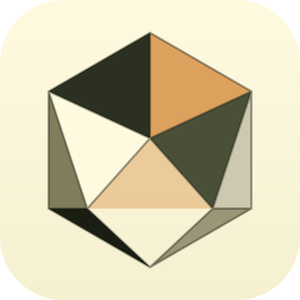

# Passive Perception

A macOS app that listens to your D&D sessions, transcribes the conversation with speaker identification, and writes campaign notes that are biased toward *your* character — what *you* experienced, what *your* goals are, what clues relate to *your* backstory.



## What It Does

1. **Captures system audio** from Discord (or any app) via native macOS Core Audio Process Taps — no virtual audio driver, no Multi-Output Device. BlackHole stays as an automatic fallback if you're on macOS < 14.2 or deny the permission.
2. **Transcribes + diarizes** the full session through **Deepgram Nova-3**, with your campaign roster fed in as `keyterm` bias so fantasy proper nouns come out correct.
3. **Identifies speakers** with a post-session Gemini pass that writes a one-line summary per speaker — you label them once in the UI (pre-filled with the best guess from your party roster) and the rest of the pipeline takes over.
4. **Classifies every utterance** as either in-character play or table-talk (rules lookups, off-topic chatter). Table-talk is dimmed in the transcript and *excluded* from the notes pass so your summary isn't polluted by the pizza order debate.
5. **Writes structured notes** with **Google Gemini 2.5 Flash** — session summary, NPCs, locations, plot points, open questions — all phrased in the second person, weighted toward what *your* character would care about.
6. **Merges back into a persistent campaign file**. New NPCs and locations append to your roster, plot points become ongoing threads, open questions become unresolved hooks. Every session builds on the last.
7. **Auto-exports** the finished notes to your Obsidian vault if configured.

## The load-bearing idea: a persistent campaign roster

A campaign file holds your character (race/class/subclass/backstory/goals), your party, the NPCs and locations you've encountered, and a free-form "what I care about" perspective field. Before each session you add a pre-session brief ("tonight we confront Xanathar — I want to find out what he knows about my brother").

All of this — the roster, the brief, your character's perspective — is injected into Gemini's system prompt every time it processes the transcript. That's what makes the notes intelligent across sessions instead of treating every recording as a blank slate.

## Requirements

- **macOS 14.2 or later, Apple Silicon** (older Macs can fall back to BlackHole 2ch)
- **Python 3.11** (the setup script installs this via pyenv)
- **Homebrew** ([install here](https://brew.sh))
- **Xcode Command Line Tools** (for building the native system-audio helper) — run `xcode-select --install` if not present
- A **[Deepgram](https://console.deepgram.com/)** API key — $200 of free credit, no card required
- A **[Google Gemini](https://aistudio.google.com/apikey)** API key — generous free tier works

No cloud subscription on our side — you bring your own API keys so you control the billing. Every call is sent with `mip_opt_out=true` to Deepgram and Gemini's paid-tier no-training guarantee kicks in once you enable billing.

## Install

1. Download the latest DMG from [Releases](https://github.com/letuswrapped/PassivePerception/releases/latest)
2. Drag **Passive Perception** to Applications and launch it
3. Walk through onboarding: enter both API keys → create your first campaign (name + character) → done
4. You're on the home screen. Write a pre-session brief, hit **Record**, play your game. macOS will ask permission to capture system audio the first time — click **Allow**.

## Quick Start (from source)

```bash
git clone https://github.com/letuswrapped/PassivePerception.git
cd PassivePerception
./setup.sh                          # Python 3.11 + venv + deps + Swift helper
source .venv/bin/activate
python run.py                       # opens the native window
```

Keys can be entered through Settings → API Keys in the app, or placed manually in `~/Library/Application Support/Passive Perception/.env`:

```
DEEPGRAM_API_KEY=...
GEMINI_API_KEY=...
```

## Audio Setup

On macOS 14.2+, there is nothing to set up. The first time you press **Record**, macOS asks permission to capture system audio — click **Allow** and you're done. No virtual audio driver, no Multi-Output Device.

**On macOS 13.x or if you deny the permission**, the app falls back to BlackHole 2ch automatically when it's installed. Setup for that path:

1. `brew install blackhole-2ch`
2. Open **Audio MIDI Setup** (Applications > Utilities)
3. Click **+** at the bottom-left → **Create Multi-Output Device**
4. Check both your **headphones/speakers** and **BlackHole 2ch**
5. Right-click the new device → **Use This Device For Sound Output**
6. In Discord: Settings → Voice & Video → Output Device → **Multi-Output Device**

To force the BlackHole path explicitly (e.g. if you prefer the audible-feedback behavior of a Multi-Output Device), set `audio.device: "BlackHole 2ch"` in `config.yaml`.

## How a session runs

1. **Home** — pick your campaign, fill in tonight's pre-session brief, hit **Record**.
2. **Live** — the app captures silently. No live transcript (you're playing, not reading). Your roster is shown in the sidebar so you can see exactly what context is feeding the AI. Notes panel refreshes every ~15 minutes with a rough preview.
3. **Stop** — Deepgram transcribes the full session with diarization + keyterm bias. Gemini runs **Pass 1** to summarize each speaker and classify every utterance. Takes ~20 seconds.
4. **Label speakers** — one card per speaker with a one-line summary, sample quotes, and a pre-filled guess from your roster. You type names (or hit **Skip** to use "Speaker 1/2/3") and click **Finalize**.
5. **Notes** — Gemini's **Pass 2** runs over the *labeled + in-character-only* transcript. You get summary, NPCs, locations, plot points, open questions.
6. **Campaign merge** — new entities append to your roster, the summary becomes the "last time on…" recap for next session. Obsidian export fires if configured.

If you quit mid-labeling, the next launch offers a **Resume labeling** banner — Pass 1 artifacts are persisted to disk, nothing is lost.

## Configuration

`config.yaml` for non-secret runtime behaviour:

```yaml
audio:
  device: "system_audio"      # native macOS Process Tap (14.2+); falls back to BlackHole
  chunk_duration: 30          # seconds per on-disk WAV chunk
notes:
  update_interval: 900        # seconds between mid-session notes refreshes (default 15 min)
output:
  directory: "./sessions"
  auto_delete_audio: true
```

API keys live in `~/Library/Application Support/Passive Perception/.env` (never in the repo, never in `config.yaml`).

## Architecture

```
Record:   System Audio + mic → AudioCapture → 30s WAV chunks → disk
Every 15 min:   new chunks → Deepgram (preview) → Gemini preview pass → notes panel
Stop (Pass 1):  all chunks → Deepgram (diarize + keyterm) → canonical transcript
                → Gemini Pass 1 → per-speaker summaries + in_character/other tags
                → pass1.json + transcript.md written to disk
Label speakers
Finalize (Pass 2):  labeled + in_character-only transcript → Gemini → SessionNotes
                    → notes.md + Obsidian export + campaign roster merge
```

Session state is a proper state machine: `RUNNING → PROCESSING_PASS1 → AWAITING_LABELS → PROCESSING_PASS2 → IDLE`. Pass 1 artifacts on disk mean an app crash between labeling and finalize doesn't lose work — the next launch offers to resume.

## Project Structure

```
PassivePerception/
├── run.py                    # Entry point, native window (pywebview)
├── config.yaml               # Non-secret runtime config
├── setup.sh                  # One-command dev setup
├── build_macos.sh            # Signed + notarized .app + DMG
├── native/macos/pp-system-audio/  # Swift helper — Core Audio Process Tap, streams PCM to stdout
├── src/
│   ├── app.py                # FastAPI routes — REST only, no WebSockets
│   ├── cloud_config.py       # API key storage in Application Support/.env
│   ├── audio/                # Capture, buffering, device enumeration (+ macos_system backend)
│   ├── campaign/             # Persistent campaign roster (Pydantic + JSON per file)
│   ├── transcription/        # Deepgram Nova-3 wrapper + WAV concat
│   ├── notes/                # Gemini pass 1 + pass 2, Pydantic schemas, prompts
│   ├── session/              # Lifecycle state machine, storage, Obsidian export
│   └── ui/static/            # Frontend — vanilla HTML/CSS/JS, no build step
└── sessions/                 # Saved session data (gitignored)
```

## Tech Stack

- **Transcription + diarization:** [Deepgram Nova-3](https://deepgram.com) via `deepgram-sdk` — single API call, `keyterm` bias, `mip_opt_out` (no retention for training)
- **Notes LLM:** [Google Gemini 2.5 Flash](https://ai.google.dev/) via `google-genai` — Pydantic structured output, 1M-token context so the full session fits in one pass
- **Campaign roster:** Pydantic models serialized to per-campaign JSON, stored alongside Obsidian vault when configured
- **Audio:** Native Core Audio Process Taps via a bundled Swift helper (`pp-system-audio`); [sounddevice](https://python-sounddevice.readthedocs.io/) for the optional secondary mic. BlackHole 2ch supported as a fallback.
- **Server:** [FastAPI](https://fastapi.tiangolo.com/) + uvicorn in a background thread
- **Window:** [pywebview](https://pywebview.flowrl.com/) frameless native macOS window with native titlebar drag
- **Frontend:** Vanilla HTML/CSS/JS — no build step, no framework

## Privacy

Audio and transcripts are sent to Deepgram and Gemini over HTTPS and are *not* retained for model training:

- Deepgram: every request carries `mip_opt_out=true` (opts out of their Model Improvement Program)
- Gemini: paid-tier API calls are not used to train their models

Neither provider retains audio after processing by default on these tiers. Sessions are stored locally in `./sessions/` and optionally mirrored to your Obsidian vault — nothing else leaves your machine.

## License

MIT
